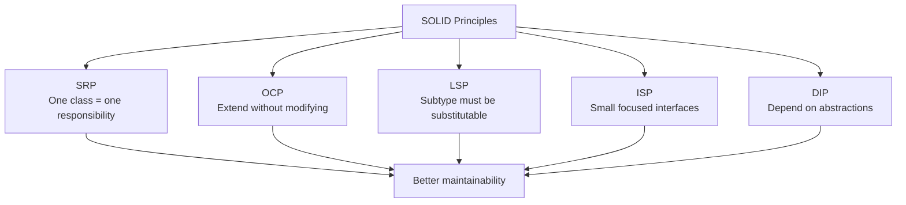
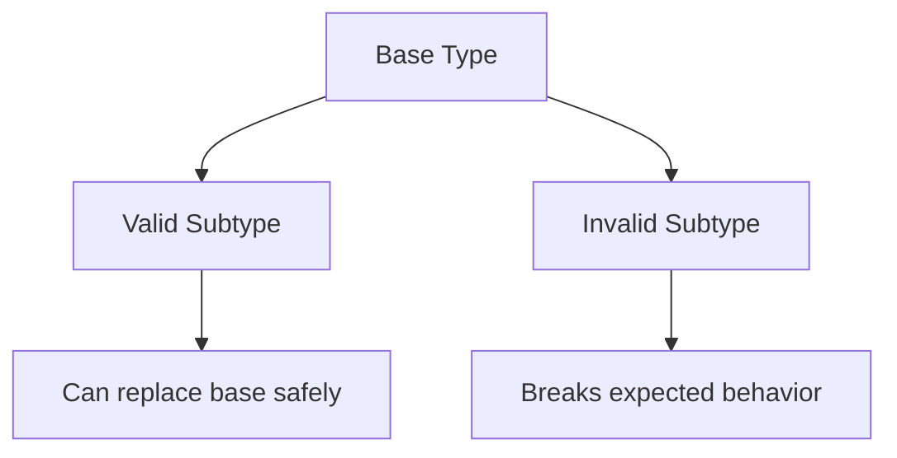
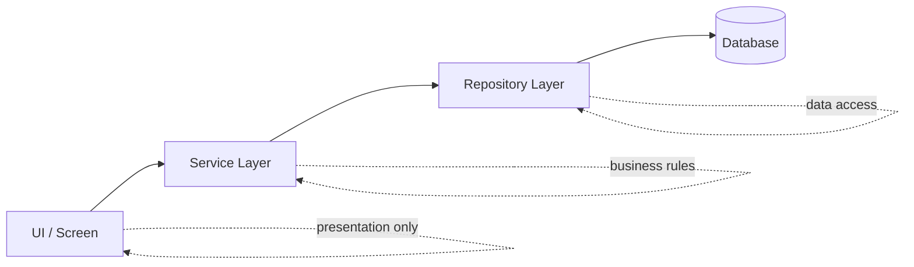
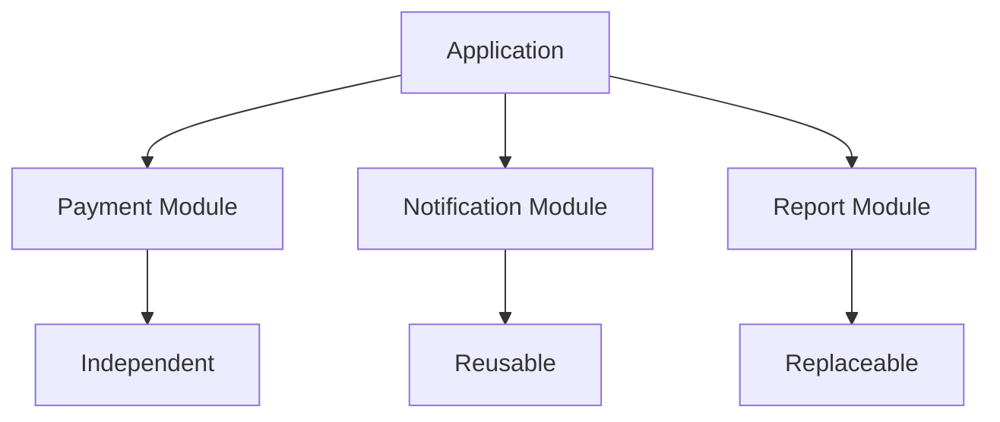

# playground
Play


# What Are Design Principles?

Design principles are general guidelines or best practices used to create software, systems, or products that are easier to understand, maintain, extend, and use.

In software engineering, design principles help developers make good decisions when writing code and structuring systems. They are not strict rules, but they guide you toward cleaner and more reliable designs.

## Why They Matter
- Improve **readability**
- Make code **maintainable**
- Support **scalability**
- Reduce **bugs and duplication**
- Make systems easier to **test and modify**

## Common Software Design Principles
- **SOLID**: A set of 5 object-oriented design principles
  - **S**: Single Responsibility Principle
  - **O**: Open/Closed Principle
  - **L**: Liskov Substitution Principle
  - **I**: Interface Segregation Principle
  - **D**: Dependency Inversion Principle
- **DRY** (*Don’t Repeat Yourself*): Avoid duplicating logic
- **KISS** (*Keep It Simple*): Prefer simple solutions
- **YAGNI** (*You Aren’t Gonna Need It*): Don’t build features before they are needed
- **Separation of Concerns**: Keep different responsibilities isolated
- **Encapsulation**: Hide internal details and expose only what is necessary
- **Modularity**: Build systems from independent, reusable parts

## Simple Example
If one class handles login, sends emails, writes logs, and talks to the database, it has too many responsibilities. A design principle like **Single Responsibility Principle** says each class should focus on one job. That makes the code easier to change and test.

## In Short
Design principles are **guidelines for building better designs**. They help you write software that is cleaner, more flexible, and easier to maintain.

---

---
# SOLID Principles - Combined Guide

This file combines **Java**, **TypeScript**, and **JavaScript** examples for SOLID principles in the following order:

1. **Java**
2. **TypeScript**
3. **JavaScript**

For each principle, I include:
- definition
- simple meaning
- when it is used
- real-time usage
- code examples in all three languages

---

# 1. Single Responsibility Principle (SRP)

## Definition
A class or module should have **only one reason to change**.

## Simple Meaning
One class should do one job only.

## When It Is Used
- when a class becomes too large
- when one class changes for unrelated reasons
- when testing becomes difficult

## Real-Time Usage
- order creation service
- invoice generator
- email notification service

## Java Example

```java
class OrderService {
    public void createOrder() {
        System.out.println("Order created");
    }
}

class InvoiceService {
    public void generateInvoice() {
        System.out.println("Invoice generated");
    }
}

class EmailService {
    public void sendEmail() {
        System.out.println("Email sent");
    }
}
```

## TypeScript Example

```typescript
type User = { name: string; email: string };

class UserService {
  createUser(user: User): void {
    console.log(`User created: ${user.name}`);
  }
}

class UserRepository {
  save(user: User): void {
    console.log(`Saving ${user.name}`);
  }
}

class EmailService {
  sendWelcomeEmail(user: User): void {
    console.log(`Sending email to ${user.email}`);
  }
}
```

## JavaScript Example

```javascript
class UserService {
  createUser(user) {
    console.log(`User created: ${user.name}`);
  }
}

class UserRepository {
  save(user) {
    console.log(`Saving ${user.name}`);
  }
}

class EmailService {
  sendWelcomeEmail(user) {
    console.log(`Sending email to ${user.email}`);
  }
}
```

---

# 2. Open/Closed Principle (OCP)

## Definition
Software entities should be **open for extension** but **closed for modification**.

## Simple Meaning
We should add new behavior without changing old tested code.

## When It Is Used
- when new features are added often
- when new strategies or modules are expected
- when existing code should remain stable

## Real-Time Usage
- payment gateways
- report generation systems
- notification systems

## Java Example

```java
interface DiscountStrategy {
    double applyDiscount(double amount);
}

class RegularDiscount implements DiscountStrategy {
    public double applyDiscount(double amount) {
        return amount * 0.1;
    }
}

class PremiumDiscount implements DiscountStrategy {
    public double applyDiscount(double amount) {
        return amount * 0.2;
    }
}
```

## TypeScript Example

```typescript
interface DiscountStrategy {
  calculate(amount: number): number;
}

class RegularDiscount implements DiscountStrategy {
  calculate(amount: number): number {
    return amount * 0.1;
  }
}

class PremiumDiscount implements DiscountStrategy {
  calculate(amount: number): number {
    return amount * 0.2;
  }
}

class PriceCalculator {
  constructor(private strategy: DiscountStrategy) {}

  getDiscount(amount: number): number {
    return this.strategy.calculate(amount);
  }
}
```

## JavaScript Example

```javascript
class RegularDiscount {
  calculate(amount) {
    return amount * 0.1;
  }
}

class PremiumDiscount {
  calculate(amount) {
    return amount * 0.2;
  }
}

class PriceCalculator {
  constructor(strategy) {
    this.strategy = strategy;
  }

  getDiscount(amount) {
    return this.strategy.calculate(amount);
  }
}
```

### Explanation
These examples use the same pattern in all three languages: the calculator depends on a discount strategy rather than a specific discount type. To add a new discount, we create a new strategy class instead of modifying the calculator.

---

# 3. Liskov Substitution Principle (LSP)

## Definition
Subclasses should be replaceable for base classes without breaking the application.

---



---
## Simple Meaning
If child class extends parent class, it should work correctly anywhere the parent is used.

## When It Is Used
- while designing inheritance
- while building reusable frameworks
- while replacing one implementation with another

## Real-Time Usage
- UI components
- storage providers
- authentication systems

## Java Example

```java
interface Shape {
    int getArea();
}

class Rectangle implements Shape {
    private int width;
    private int height;

    public Rectangle(int width, int height) {
        this.width = width;
        this.height = height;
    }

    public int getArea() {
        return width * height;
    }
}

class Square implements Shape {
    private int side;

    public Square(int side) {
        this.side = side;
    }

    public int getArea() {
        return side * side;
    }
}
```

## TypeScript Example

```typescript
abstract class Shape {
  abstract area(): number;
}

class Rectangle extends Shape {
  constructor(private width: number, private height: number) {
    super();
  }

  area(): number {
    return this.width * this.height;
  }
}

class Square extends Shape {
  constructor(private side: number) {
    super();
  }

  area(): number {
    return this.side * this.side;
  }
}
```

## JavaScript Example

```javascript
class Shape {
  area() {}
}

class Rectangle extends Shape {
  constructor(width, height) {
    super();
    this.width = width;
    this.height = height;
  }

  area() {
    return this.width * this.height;
  }
}

class Square extends Shape {
  constructor(side) {
    super();
    this.side = side;
  }

  area() {
    return this.side * this.side;
  }
}
```

---

# 4. Interface Segregation Principle (ISP)

## Definition
Clients should not be forced to depend on methods they do not use.

## Simple Meaning
Prefer smaller, focused interfaces instead of one large interface.

## When It Is Used
- when interfaces become too large
- when some classes implement unused methods
- when unsupported operations appear

## Real-Time Usage
- role-based systems
- printer/scanner systems
- frontend service layers

## Java Example

```java
interface Printer {
    void print();
}

interface Scanner {
    void scan();
}

class BasicPrinter implements Printer {
    public void print() {
        System.out.println("Printing document");
    }
}

class MultiFunctionPrinter implements Printer, Scanner {
    public void print() {
        System.out.println("Printing document");
    }

    public void scan() {
        System.out.println("Scanning document");
    }
}
```

## TypeScript Example

```typescript
interface Printer {
  print(): void;
}

interface Scanner {
  scan(): void;
}

class BasicPrinter implements Printer {
  print(): void {
    console.log("Printing...");
  }
}

class MultiFunctionPrinter implements Printer, Scanner {
  print(): void {
    console.log("Printing...");
  }

  scan(): void {
    console.log("Scanning...");
  }
}
```

## JavaScript Example

JavaScript does not have formal interfaces like Java or TypeScript, so we usually represent ISP by keeping related capabilities in separate focused classes or objects.

```javascript
class Printer {
  print(document) {
    console.log(`Printing ${document}`);
  }
}

class Scanner {
  scan(document) {
    console.log(`Scanning ${document}`);
  }
}

class BasicPrinter {
  constructor(printer) {
    this.printer = printer;
  }

  print(document) {
    this.printer.print(document);
  }
}
```

---

# 5. Dependency Inversion Principle (DIP)

## Definition
High-level modules should not depend on low-level modules. Both should depend on abstractions.

## Simple Meaning
Business logic should depend on interfaces or abstractions, not concrete classes.

## When It Is Used
- when infrastructure may change
- when testability is important
- when loose coupling is needed

## Real-Time Usage
- repositories
- logging systems
- notification systems
- dependency injection frameworks

## Java Example

```java
interface Database {
    void save(String data);
}

class MySQLDatabase implements Database {
    public void save(String data) {
        System.out.println("Saving to MySQL: " + data);
    }
}

class UserService {
    private Database database;

    public UserService(Database database) {
        this.database = database;
    }

    public void saveUser(String user) {
        database.save(user);
    }
}
```

## TypeScript Example

```typescript
interface Database {
  save(data: string): void;
}

class MySQLDatabase implements Database {
  save(data: string): void {
    console.log(`Saving ${data} in MySQL`);
  }
}

class UserService {
  constructor(private database: Database) {}

  createUser(name: string): void {
    this.database.save(name);
  }
}
```

## JavaScript Example

```javascript
class MySQLDatabase {
  save(data) {
    console.log(`Saving ${data} in MySQL`);
  }
}

class UserService {
  constructor(database) {
    this.database = database;
  }

  createUser(user) {
    this.database.save(user.name);
  }
}
```

### Note
In JavaScript, Dependency Inversion is often achieved through dependency injection and duck typing. Instead of a formal interface, the high-level class depends on any object that provides the required `save()` method.

---

# Final Conclusion

This merged note shows how the same SOLID principles apply across:
- **Java**
- **TypeScript**
- **JavaScript**

The core design idea stays the same, but the syntax changes depending on the language.

If you want, I can next create:
1. a **better formatted merged version** with **2 examples per principle in all 3 languages**, or
2. a **table-based revision sheet** for fast exam/interview preparation.

---

# DRY, KISS, and YAGNI Principles

This section extends the SOLID notes with three other very important software design principles:

- **DRY** (*Don't Repeat Yourself*)
- **KISS** (*Keep It Simple*)
- **YAGNI** (*You Aren't Gonna Need It*)

These principles help us write code that is easier to maintain, easier to understand, and less wasteful.

---

# 1. DRY (Don't Repeat Yourself)

## Definition
DRY means **every piece of knowledge or logic should have one clear source instead of being repeated in many places**.

## Detailed Explanation
When the same logic is copied again and again, changing that logic becomes risky. If you fix one place but forget another, bugs appear. DRY does **not** mean removing every repeated line blindly. It means avoiding repetition of **important logic, rules, and behavior**.

For example, if tax calculation is written in five different methods, then every future tax change must be updated in five places. A better design is to move that logic into one shared method or utility.

## Why It Matters
- reduces maintenance effort
- lowers the chance of inconsistent behavior
- makes bug fixes easier
- improves readability by centralizing common logic

## Example 1: Discount Calculation Repeated in Multiple Methods

### Bad Code - Java

```java
class PriceService {
    public double getLaptopPrice(double price) {
        double discount = price * 0.10;
        return price - discount;
    }

    public double getMobilePrice(double price) {
        double discount = price * 0.10;
        return price - discount;
    }
}
```

### Improved Code - Java

```java
class PriceService {
    private double applyDiscount(double price) {
        double discount = price * 0.10;
        return price - discount;
    }

    public double getLaptopPrice(double price) {
        return applyDiscount(price);
    }

    public double getMobilePrice(double price) {
        return applyDiscount(price);
    }
}
```

### Bad Code - TypeScript

```typescript
class PriceService {
  getLaptopPrice(price: number): number {
    const discount = price * 0.1;
    return price - discount;
  }

  getMobilePrice(price: number): number {
    const discount = price * 0.1;
    return price - discount;
  }
}
```

### Improved Code - TypeScript

```typescript
class PriceService {
  private applyDiscount(price: number): number {
    const discount = price * 0.1;
    return price - discount;
  }

  getLaptopPrice(price: number): number {
    return this.applyDiscount(price);
  }

  getMobilePrice(price: number): number {
    return this.applyDiscount(price);
  }
}
```

### Bad Code - JavaScript

```javascript
class PriceService {
  getLaptopPrice(price) {
    const discount = price * 0.1;
    return price - discount;
  }

  getMobilePrice(price) {
    const discount = price * 0.1;
    return price - discount;
  }
}
```

### Improved Code - JavaScript

```javascript
class PriceService {
  applyDiscount(price) {
    const discount = price * 0.1;
    return price - discount;
  }

  getLaptopPrice(price) {
    return this.applyDiscount(price);
  }

  getMobilePrice(price) {
    return this.applyDiscount(price);
  }
}
```

### Explanation
In the bad version, the same discount logic is copied into multiple methods. In the improved version, the logic is centralized in one place. If the discount changes from 10% to 15%, we only update one method.

## Example 2: Repeated Validation Logic

### Bad Code - Java

```java
class UserValidator {
    public boolean validateForLogin(String email) {
        return email != null && email.contains("@");
    }

    public boolean validateForSignup(String email) {
        return email != null && email.contains("@");
    }
}
```

### Improved Code - Java

```java
class UserValidator {
    private boolean isValidEmail(String email) {
        return email != null && email.contains("@");
    }

    public boolean validateForLogin(String email) {
        return isValidEmail(email);
    }

    public boolean validateForSignup(String email) {
        return isValidEmail(email);
    }
}
```

### Bad Code - TypeScript

```typescript
class UserValidator {
  validateForLogin(email: string | null): boolean {
    return email !== null && email.includes("@");
  }

  validateForSignup(email: string | null): boolean {
    return email !== null && email.includes("@");
  }
}
```

### Improved Code - TypeScript

```typescript
class UserValidator {
  private isValidEmail(email: string | null): boolean {
    return email !== null && email.includes("@");
  }

  validateForLogin(email: string | null): boolean {
    return this.isValidEmail(email);
  }

  validateForSignup(email: string | null): boolean {
    return this.isValidEmail(email);
  }
}
```

### Bad Code - JavaScript

```javascript
class UserValidator {
  validateForLogin(email) {
    return email != null && email.includes("@");
  }

  validateForSignup(email) {
    return email != null && email.includes("@");
  }
}
```

### Improved Code - JavaScript

```javascript
class UserValidator {
  isValidEmail(email) {
    return email != null && email.includes("@");
  }

  validateForLogin(email) {
    return this.isValidEmail(email);
  }

  validateForSignup(email) {
    return this.isValidEmail(email);
  }
}
```

### Explanation
The repeated validation rule is extracted into one shared method. This makes the code cleaner and prevents future inconsistencies.

---

# 2. KISS (Keep It Simple)

## Definition
KISS means **prefer the simplest solution that correctly solves the problem**.

## Detailed Explanation
Many developers make code more complex than needed because they think complex code looks smarter or more flexible. But complex code is usually harder to test, harder to debug, and harder for others to understand.

KISS reminds us to avoid unnecessary abstractions, deeply nested logic, and over-engineered designs when a simple approach works well.

## Why It Matters
- easier to read and explain
- easier to debug
- easier to test
- reduces accidental complexity

## Example 1: Overcomplicated Boolean Check

### Bad Code - Java

```java
class AccessService {
    public boolean canLogin(boolean isActive) {
        if (isActive == true) {
            return true;
        } else {
            return false;
        }
    }
}
```

### Improved Code - Java

```java
class AccessService {
    public boolean canLogin(boolean isActive) {
        return isActive;
    }
}
```

### Bad Code - TypeScript

```typescript
class AccessService {
  canLogin(isActive: boolean): boolean {
    if (isActive === true) {
      return true;
    } else {
      return false;
    }
  }
}
```

### Improved Code - TypeScript

```typescript
class AccessService {
  canLogin(isActive: boolean): boolean {
    return isActive;
  }
}
```

### Bad Code - JavaScript

```javascript
class AccessService {
  canLogin(isActive) {
    if (isActive === true) {
      return true;
    } else {
      return false;
    }
  }
}
```

### Improved Code - JavaScript

```javascript
class AccessService {
  canLogin(isActive) {
    return isActive;
  }
}
```

### Explanation
The bad version uses unnecessary condition checks for a value that is already boolean. The improved version is smaller, clearer, and easier to read.

## Example 2: Unnecessary Extra Classes or Helpers

### Bad Code - Java

```java
class NumberFormatter {
    public String format(int number) {
        return String.valueOf(number);
    }
}

class ReportService {
    private NumberFormatter formatter = new NumberFormatter();

    public void printReportId(int id) {
        System.out.println("Report ID: " + formatter.format(id));
    }
}
```

### Improved Code - Java

```java
class ReportService {
    public void printReportId(int id) {
        System.out.println("Report ID: " + id);
    }
}
```

### Bad Code - TypeScript

```typescript
class NumberFormatter {
  format(number: number): string {
    return String(number);
  }
}

class ReportService {
  private formatter = new NumberFormatter();

  printReportId(id: number): void {
    console.log(`Report ID: ${this.formatter.format(id)}`);
  }
}
```

### Improved Code - TypeScript

```typescript
class ReportService {
  printReportId(id: number): void {
    console.log(`Report ID: ${id}`);
  }
}
```

### Bad Code - JavaScript

```javascript
class NumberFormatter {
  format(number) {
    return String(number);
  }
}

class ReportService {
  constructor() {
    this.formatter = new NumberFormatter();
  }

  printReportId(id) {
    console.log(`Report ID: ${this.formatter.format(id)}`);
  }
}
```

### Improved Code - JavaScript

```javascript
class ReportService {
  printReportId(id) {
    console.log(`Report ID: ${id}`);
  }
}
```

### Explanation
The bad version creates an extra formatter just to convert a number to a string, which the language already handles easily. The improved version keeps the solution direct and simple.

---

# 3. YAGNI (You Aren't Gonna Need It)

## Definition
YAGNI means **do not build functionality until it is actually needed**.

## Detailed Explanation
Developers sometimes add future-ready code, extra parameters, configurable systems, or extension points “just in case.” Most of the time, those imagined future needs never happen. That extra code increases complexity, adds maintenance cost, and may introduce bugs.

YAGNI encourages us to build what is required today. When a new real requirement appears, then we extend the design.

## Why It Matters
- avoids wasted development effort
- keeps the codebase smaller
- reduces complexity
- helps teams focus on current requirements

## Example 1: Adding Unused Export Formats

### Bad Code - Java

```java
class ReportExporter {
    public void export(String format, String data) {
        if (format.equals("PDF")) {
            System.out.println("Exporting PDF: " + data);
        } else if (format.equals("CSV")) {
            System.out.println("Exporting CSV: " + data);
        } else if (format.equals("XML")) {
            System.out.println("Exporting XML: " + data);
        }
    }
}
```

### Improved Code - Java

```java
class ReportExporter {
    public void exportPdf(String data) {
        System.out.println("Exporting PDF: " + data);
    }
}
```

### Bad Code - TypeScript

```typescript
class ReportExporter {
  export(format: string, data: string): void {
    if (format === "PDF") {
      console.log(`Exporting PDF: ${data}`);
    } else if (format === "CSV") {
      console.log(`Exporting CSV: ${data}`);
    } else if (format === "XML") {
      console.log(`Exporting XML: ${data}`);
    }
  }
}
```

### Improved Code - TypeScript

```typescript
class ReportExporter {
  exportPdf(data: string): void {
    console.log(`Exporting PDF: ${data}`);
  }
}
```

### Bad Code - JavaScript

```javascript
class ReportExporter {
  export(format, data) {
    if (format === "PDF") {
      console.log(`Exporting PDF: ${data}`);
    } else if (format === "CSV") {
      console.log(`Exporting CSV: ${data}`);
    } else if (format === "XML") {
      console.log(`Exporting XML: ${data}`);
    }
  }
}
```

### Improved Code - JavaScript

```javascript
class ReportExporter {
  exportPdf(data) {
    console.log(`Exporting PDF: ${data}`);
  }
}
```

### Explanation
If the current requirement only asks for PDF export, adding CSV and XML support now is premature. The improved version implements only what is needed today.

## Example 2: Adding Extra Parameters for Imaginary Future Needs

### Bad Code - Java

```java
class EmailService {
    public void sendEmail(String to, String subject, String body, boolean highPriority, String cc, String bcc) {
        System.out.println("Email sent to " + to);
    }
}
```

### Improved Code - Java

```java
class EmailService {
    public void sendEmail(String to, String subject, String body) {
        System.out.println("Email sent to " + to);
    }
}
```

### Bad Code - TypeScript

```typescript
class EmailService {
  sendEmail(
    to: string,
    subject: string,
    body: string,
    highPriority: boolean,
    cc: string,
    bcc: string
  ): void {
    console.log(`Email sent to ${to}`);
  }
}
```

### Improved Code - TypeScript

```typescript
class EmailService {
  sendEmail(to: string, subject: string, body: string): void {
    console.log(`Email sent to ${to}`);
  }
}
```

### Bad Code - JavaScript

```javascript
class EmailService {
  sendEmail(to, subject, body, highPriority, cc, bcc) {
    console.log(`Email sent to ${to}`);
  }
}
```

### Improved Code - JavaScript

```javascript
class EmailService {
  sendEmail(to, subject, body) {
    console.log(`Email sent to ${to}`);
  }
}
```

### Explanation
The bad version adds options that are not currently required. This makes the API more complex for no real benefit. The improved version focuses only on present needs.

---

# Final Summary

## DRY
Avoid repeating the same logic in multiple places. Centralize shared behavior so updates are easy and consistent.

## KISS
Choose the simplest solution that correctly solves the problem. Simple code is easier to understand, test, and maintain.

## YAGNI
Do not implement features before they are needed. Build for current requirements, not imagined future possibilities.

Together, **DRY**, **KISS**, and **YAGNI** help developers write code that is:

- cleaner
- simpler
- easier to maintain
- less error-prone
- more focused on real requirements

---

# Separation of Concerns, Encapsulation, and Modularity

This section adds three more important design principles that help us organize software in a cleaner and more maintainable way:

- **Separation of Concerns**: Keep different responsibilities isolated
- **Encapsulation**: Hide internal details and expose only what is necessary
- **Modularity**: Build systems from independent, reusable parts

These ideas are useful in almost every kind of software project, from small applications to large enterprise systems.

---

# 1. Separation of Concerns

## Definition
Separation of Concerns means **different parts of a program should handle different responsibilities**.

---


---
## Detailed Explanation
When one class or module tries to do too many unrelated things, the code becomes difficult to understand and maintain. For example, if a single class handles user input, validation, business rules, database access, and logging, then changing one concern may accidentally affect another.

Separation of Concerns encourages us to split code by responsibility. A UI layer should focus on presentation, a service layer should focus on business rules, and a repository layer should focus on storing or retrieving data.

## Why It Matters
- improves readability
- makes testing easier
- reduces side effects between unrelated parts
- allows teams to change one concern without breaking others

## Example 1: One Class Handling User Save and Email Logic

### Bad Code - Java

```java
class UserManager {
    public void createUser(String name, String email) {
        System.out.println("Saving user: " + name);
        System.out.println("Sending welcome email to: " + email);
    }
}
```

### Improved Code - Java

```java
class UserRepository {
    public void save(String name) {
        System.out.println("Saving user: " + name);
    }
}

class EmailService {
    public void sendWelcomeEmail(String email) {
        System.out.println("Sending welcome email to: " + email);
    }
}

class UserService {
    private UserRepository userRepository = new UserRepository();
    private EmailService emailService = new EmailService();

    public void createUser(String name, String email) {
        userRepository.save(name);
        emailService.sendWelcomeEmail(email);
    }
}
```

### Bad Code - TypeScript

```typescript
class UserManager {
  createUser(name: string, email: string): void {
    console.log(`Saving user: ${name}`);
    console.log(`Sending welcome email to: ${email}`);
  }
}
```

### Improved Code - TypeScript

```typescript
class UserRepository {
  save(name: string): void {
    console.log(`Saving user: ${name}`);
  }
}

class EmailService {
  sendWelcomeEmail(email: string): void {
    console.log(`Sending welcome email to: ${email}`);
  }
}

class UserService {
  private userRepository = new UserRepository();
  private emailService = new EmailService();

  createUser(name: string, email: string): void {
    this.userRepository.save(name);
    this.emailService.sendWelcomeEmail(email);
  }
}
```

### Bad Code - JavaScript

```javascript
class UserManager {
  createUser(name, email) {
    console.log(`Saving user: ${name}`);
    console.log(`Sending welcome email to: ${email}`);
  }
}
```

### Improved Code - JavaScript

```javascript
class UserRepository {
  save(name) {
    console.log(`Saving user: ${name}`);
  }
}

class EmailService {
  sendWelcomeEmail(email) {
    console.log(`Sending welcome email to: ${email}`);
  }
}

class UserService {
  constructor() {
    this.userRepository = new UserRepository();
    this.emailService = new EmailService();
  }

  createUser(name, email) {
    this.userRepository.save(name);
    this.emailService.sendWelcomeEmail(email);
  }
}
```

### Explanation
The bad version mixes persistence and email behavior in one place. The improved version separates these concerns into dedicated classes, making the system easier to test and maintain.

## Example 2: UI Class Also Handling Data Access

### Bad Code - Java

```java
class ProductScreen {
    public void showProduct() {
        String productName = "Laptop";
        double price = 50000;
        System.out.println("Product: " + productName + " Price: " + price);
    }
}
```

### Improved Code - Java

```java
class ProductRepository {
    public String getProductName() {
        return "Laptop";
    }

    public double getPrice() {
        return 50000;
    }
}

class ProductScreen {
    private ProductRepository productRepository = new ProductRepository();

    public void showProduct() {
        String productName = productRepository.getProductName();
        double price = productRepository.getPrice();
        System.out.println("Product: " + productName + " Price: " + price);
    }
}
```

### Bad Code - TypeScript

```typescript
class ProductScreen {
  showProduct(): void {
    const productName = "Laptop";
    const price = 50000;
    console.log(`Product: ${productName} Price: ${price}`);
  }
}
```

### Improved Code - TypeScript

```typescript
class ProductRepository {
  getProductName(): string {
    return "Laptop";
  }

  getPrice(): number {
    return 50000;
  }
}

class ProductScreen {
  private productRepository = new ProductRepository();

  showProduct(): void {
    const productName = this.productRepository.getProductName();
    const price = this.productRepository.getPrice();
    console.log(`Product: ${productName} Price: ${price}`);
  }
}
```

### Bad Code - JavaScript

```javascript
class ProductScreen {
  showProduct() {
    const productName = "Laptop";
    const price = 50000;
    console.log(`Product: ${productName} Price: ${price}`);
  }
}
```

### Improved Code - JavaScript

```javascript
class ProductRepository {
  getProductName() {
    return "Laptop";
  }

  getPrice() {
    return 50000;
  }
}

class ProductScreen {
  constructor() {
    this.productRepository = new ProductRepository();
  }

  showProduct() {
    const productName = this.productRepository.getProductName();
    const price = this.productRepository.getPrice();
    console.log(`Product: ${productName} Price: ${price}`);
  }
}
```

### ExplanationW
The improved version separates data access from presentation. This makes it easier to change how data is fetched or how the UI is shown without affecting the other part.

---

# 2. Encapsulation

## Definition
Encapsulation means **keeping internal data and implementation details private, while exposing only controlled ways to interact with them**.

---

```mermaid
flowchart LR
    EXT[External Code] -->|calls methods| OBJ[BankAccount Object]
    OBJ -->|public API| DEPOSIT[deposit()]
    OBJ -->|public API| WITHDRAW[withdraw()]
    OBJ -->|hides| BAL[Private balance]

    DEPOSIT --> BAL
    WITHDRAW --> BAL
```

---


## Detailed Explanation
If internal fields are freely accessible, any part of the program can change them in unsafe ways. This can lead to invalid state and unpredictable behavior. Encapsulation protects data by hiding it behind methods that enforce rules.

For example, a bank account should not allow anyone to directly set the balance to a negative number. Instead, methods like `deposit()` and `withdraw()` should control how the balance changes.

## Why It Matters
- protects object state
- prevents invalid updates
- makes code safer and easier to reason about
- hides implementation details from outside code

## Example 1: Direct Access to Account Balance

### Bad Code - Java

```java
class BankAccount {
    public double balance;
}
```

### Improved Code - Java

```java
class BankAccount {
    private double balance;

    public void deposit(double amount) {
        if (amount > 0) {
            balance += amount;
        }
    }

    public double getBalance() {
        return balance;
    }
}
```

### Bad Code - TypeScript

```typescript
class BankAccount {
  balance: number = 0;
}
```

### Improved Code - TypeScript

```typescript
class BankAccount {
  private balance: number = 0;

  deposit(amount: number): void {
    if (amount > 0) {
      this.balance += amount;
    }
  }

  getBalance(): number {
    return this.balance;
  }
}
```

### Bad Code - JavaScript

```javascript
class BankAccount {
  constructor() {
    this.balance = 0;
  }
}
```

### Improved Code - JavaScript

```javascript
class BankAccount {
  #balance = 0;

  deposit(amount) {
    if (amount > 0) {
      this.#balance += amount;
    }
  }

  getBalance() {
    return this.#balance;
  }
}
```

### Explanation
In the bad version, any code can directly change the balance to any value. In the improved version, the class controls updates and protects its internal state.

## Example 2: Exposing Internal Employee Data Without Control

### Bad Code - Java

```java
class Employee {
    public String name;
    public int age;
}
```

### Improved Code - Java

```java
class Employee {
    private String name;
    private int age;

    public Employee(String name, int age) {
        this.name = name;
        setAge(age);
    }

    public String getName() {
        return name;
    }

    public int getAge() {
        return age;
    }

    public void setAge(int age) {
        if (age > 0) {
            this.age = age;
        }
    }
}
```

### Bad Code - TypeScript

```typescript
class Employee {
  name: string;
  age: number;

  constructor(name: string, age: number) {
    this.name = name;
    this.age = age;
  }
}
```

### Improved Code - TypeScript

```typescript
class Employee {
  private name: string;
  private age: number;

  constructor(name: string, age: number) {
    this.name = name;
    this.setAge(age);
  }

  getName(): string {
    return this.name;
  }

  getAge(): number {
    return this.age;
  }

  setAge(age: number): void {
    if (age > 0) {
      this.age = age;
    }
  }
}
```

### Bad Code - JavaScript

```javascript
class Employee {
  constructor(name, age) {
    this.name = name;
    this.age = age;
  }
}
```

### Improved Code - JavaScript

```javascript
class Employee {
  #name;
  #age;

  constructor(name, age) {
    this.#name = name;
    this.setAge(age);
  }

  getName() {
    return this.#name;
  }

  getAge() {
    return this.#age;
  }

  setAge(age) {
    if (age > 0) {
      this.#age = age;
    }
  }
}
```

### Explanation
The improved code hides internal fields and validates updates through methods. This reduces the chance of invalid or accidental modifications.

---

# 3. Modularity

## Definition
Modularity means **building a system from small, independent, and reusable parts**.

---



---
## Detailed Explanation
In a modular system, each part handles a focused responsibility and can often be developed, tested, or replaced separately. Instead of writing one large block of tightly connected code, we create modules that cooperate through clear boundaries.

This improves reuse and makes the system easier to extend. For example, a payment module, notification module, and reporting module can all be developed independently and used in different parts of the application.

## Why It Matters
- improves reuse
- makes maintenance easier
- supports independent testing
- reduces the impact of change in one part of the system

## Example 1: One Big Utility Class Doing Everything

### Bad Code - Java

```java
class ApplicationHelper {
    public void sendEmail() {
        System.out.println("Sending email");
    }

    public void generateReport() {
        System.out.println("Generating report");
    }

    public void processPayment() {
        System.out.println("Processing payment");
    }
}
```

### Improved Code - Java

```java
class EmailModule {
    public void sendEmail() {
        System.out.println("Sending email");
    }
}

class ReportModule {
    public void generateReport() {
        System.out.println("Generating report");
    }
}

class PaymentModule {
    public void processPayment() {
        System.out.println("Processing payment");
    }
}
```

### Bad Code - TypeScript

```typescript
class ApplicationHelper {
  sendEmail(): void {
    console.log("Sending email");
  }

  generateReport(): void {
    console.log("Generating report");
  }

  processPayment(): void {
    console.log("Processing payment");
  }
}
```

### Improved Code - TypeScript

```typescript
class EmailModule {
  sendEmail(): void {
    console.log("Sending email");
  }
}

class ReportModule {
  generateReport(): void {
    console.log("Generating report");
  }
}

class PaymentModule {
  processPayment(): void {
    console.log("Processing payment");
  }
}
```

### Bad Code - JavaScript

```javascript
class ApplicationHelper {
  sendEmail() {
    console.log("Sending email");
  }

  generateReport() {
    console.log("Generating report");
  }

  processPayment() {
    console.log("Processing payment");
  }
}
```

### Improved Code - JavaScript

```javascript
class EmailModule {
  sendEmail() {
    console.log("Sending email");
  }
}

class ReportModule {
  generateReport() {
    console.log("Generating report");
  }
}

class PaymentModule {
  processPayment() {
    console.log("Processing payment");
  }
}
```

### Explanation
The bad version groups unrelated features into one large class. The improved version breaks the system into smaller reusable modules with clear purposes.

## Example 2: Reusing a Notification Module Instead of Duplicating Behavior

### Bad Code - Java

```java
class OrderService {
    public void placeOrder() {
        System.out.println("Order placed");
        System.out.println("Notification sent");
    }
}

class PaymentService {
    public void makePayment() {
        System.out.println("Payment completed");
        System.out.println("Notification sent");
    }
}
```

### Improved Code - Java

```java
class NotificationModule {
    public void sendNotification(String message) {
        System.out.println("Notification sent: " + message);
    }
}

class OrderService {
    private NotificationModule notificationModule = new NotificationModule();

    public void placeOrder() {
        System.out.println("Order placed");
        notificationModule.sendNotification("Order created");
    }
}

class PaymentService {
    private NotificationModule notificationModule = new NotificationModule();

    public void makePayment() {
        System.out.println("Payment completed");
        notificationModule.sendNotification("Payment completed");
    }
}
```

### Bad Code - TypeScript

```typescript
class OrderService {
  placeOrder(): void {
    console.log("Order placed");
    console.log("Notification sent");
  }
}

class PaymentService {
  makePayment(): void {
    console.log("Payment completed");
    console.log("Notification sent");
  }
}
```

### Improved Code - TypeScript

```typescript
class NotificationModule {
  sendNotification(message: string): void {
    console.log(`Notification sent: ${message}`);
  }
}

class OrderService {
  private notificationModule = new NotificationModule();

  placeOrder(): void {
    console.log("Order placed");
    this.notificationModule.sendNotification("Order created");
  }
}

class PaymentService {
  private notificationModule = new NotificationModule();

  makePayment(): void {
    console.log("Payment completed");
    this.notificationModule.sendNotification("Payment completed");
  }
}
```

### Bad Code - JavaScript

```javascript
class OrderService {
  placeOrder() {
    console.log("Order placed");
    console.log("Notification sent");
  }
}

class PaymentService {
  makePayment() {
    console.log("Payment completed");
    console.log("Notification sent");
  }
}
```

### Improved Code - JavaScript

```javascript
class NotificationModule {
  sendNotification(message) {
    console.log(`Notification sent: ${message}`);
  }
}

class OrderService {
  constructor() {
    this.notificationModule = new NotificationModule();
  }

  placeOrder() {
    console.log("Order placed");
    this.notificationModule.sendNotification("Order created");
  }
}

class PaymentService {
  constructor() {
    this.notificationModule = new NotificationModule();
  }

  makePayment() {
    console.log("Payment completed");
    this.notificationModule.sendNotification("Payment completed");
  }
}
```

### Explanation
Instead of embedding notification behavior inside many classes, the improved version creates a reusable notification module. This makes the code more modular and easier to extend.

---

# Final Summary

## Separation of Concerns
Keep unrelated responsibilities in separate classes or modules so each part has a clear purpose.

## Encapsulation
Hide internal state and expose controlled methods so objects remain valid and safe to use.

## Modularity
Build software from independent reusable parts so the system becomes easier to change, test, and extend.

Together, **Separation of Concerns**, **Encapsulation**, and **Modularity** help developers build software that is:

- better organized
- easier to maintain
- safer to change
- easier to test
- more reusable
